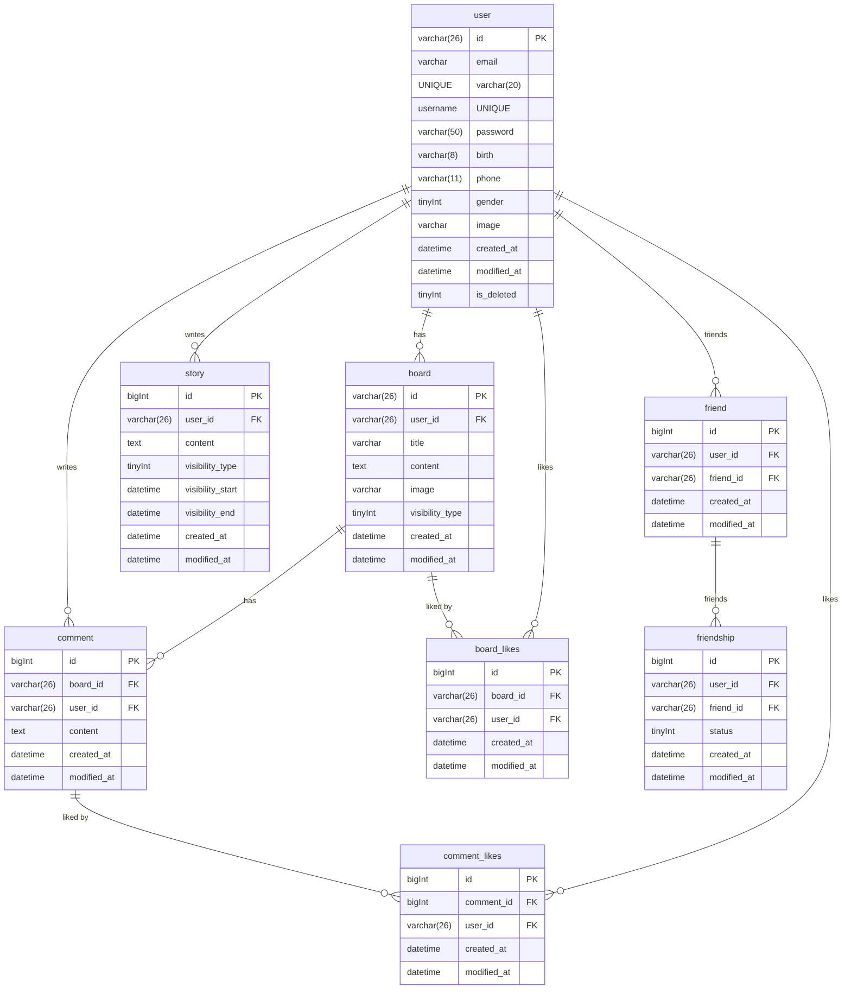

# 뉴스피드

## 개요
- 게시글을 `생성`, `조회`, `수정`, `삭제`하고 권한이 있는 사용자가 `게시글`을 수정 및 삭제할 수 있습니다.
- 로그인한 사용자는 댓글을 `생성`, `조회`, `수정`, `삭제` 하고 권한이 있는 사용자가 `댓글`을 수정 및 삭제할 수 있습니다.
- 사용자 권한은 회원가입시 입력한 `이메일`과 `비밀번호`를 통해 확인합니다.
- 친구 `신청` 및 `승인`, `거절` 처리를 할 수 있으며 친구로 등록된 사용자의 게시글을 확인할 수 있습니다.

## 프로젝트 목표
1. 게시글 `생성`, `조회`, `수정`, `삭제` 기능 구현
2. 사용자 `회원가입`, `로그인`, `회원정보수정`, `회원탈퇴`, `비밀번호 변경` 기능 구현
3. `로그인` 시 `이메일`과 `비밀번호`를 이용하여 인증
4. 게시글에 대한 `댓글` 작성 및 관리
5. 게시글을 `권한`에 따라 나누어 `친구`로 등록된 사용자만 볼 수 있는 게시글 조회
6. `게시글` 또는 `댓글`의 `좋아요`를 `등록` 및 `취소` 가능
7. 볼 수 있는 기간이 정해져있는 스토리를 `생성`, `조회`,`수정`,`삭제` 기능 구현

## 주요 기능
### 사용자 생성 및 관리
-  `유저명`, `이메일`, `비밀번호`, `생년월일`, `핸드폰번호`, `성별`, `프로필사진`을 작성하여 회원가입
- 회원가입시 입력한 비밀번호를 암호화 하여 저장
- `로그인` 시 `이메일`과 `비밀번호`를 이용하여 인증
- 다른 사용자의 프로필 조회시 일부 정보만 제공

### 게시글 생성 및 관리
- 작성자가 `제목`, `내용`, `사진` 을 입력 후 생성
- 작성자만 게시글 `수정` 및 `삭제` 권한 보유

### 댓글 생성 및 관리
- 생성되어 있는 게시글에 댓글 `작성`
- `게시글 작성자` 또는 `댓글 작성자`는 `수정` 및 `삭제` 권한 보유 

### 좋아요 기능
- 생성되어 있는 게시글 또는 댓글에 `추가` 및 `취소`

### 친구관리
- 특정 사용자를 친구로 `추가` 또는 `삭제` 가능
- 친구 신청을 받은 사용자는 `승락` 또는 `거부` 가능 

## 프로젝트 요구사항
- [x] API 명세서 작성하기
- [x] ERD 작성하기
- [x] SQL 작성하기

- [x] 회원가입
  - 아이디는 이메일 형식
  - 비밀번호는 Bcrypt 로 인코딩하여 사용
  - 대소문자 포함 영문 + 숫자 + 특수문자를 최소 1글자씩 포함
  - 비밀번호는 최소 8글자 이상


- [x] 회원탈퇴
    -  비밀번호 확인 후 탈퇴 처리
    -  탈퇴한 사용자의 아이디(이메일)은 재사용할 수 없고, 복구할 수 없음 


- [x] 프로필 조회 기능
    -  다른 사용자의 프로필 조회 시 민감한 정보는 공개되지 않음
    -  공개 범위 : username, birth, gender, image


- [x] 게시물 관리
  -  게시글 CRUD 생성
  -  수정, 삭제는 작성자 본인만 가능
  -  게시글 권한(전체 : 0, 친구만 : 1, 비공개 : 2)에 따라 공개 범위 지정


- [x] 댓글 CRUD
    -  생성된 게시글의 댓글 `저장`, `조회`, `수정`, `삭제` 가능
    -  댓글과 게시글의 `연관관계` 설정
    -  댓글 `내용`, 작성일, 수정일, `유저 고유 식별자`, `일정 고유 식별자` 필드 생성


- [x] 친구관리
  - 특정 사용자를 친구로 추가/삭제 가능
  - 친구 신청을 받은 경우 상대방의 수락 여부 체크(승인 : 1, 거절 : 2)
  - 친구의 최신 게시물들을 최신순으로 조회


- [x] 좋아요
  - 사용자는 게시물 또는 댓글에 `좋아요`를 등록 또는 취소 가능
  - 본인이 작성한 게시물과 댓글에는 좋아요 불가능
  - 동일 게시물, 댓글에는 사용자 당 `1회` 좋아요 가능

- [x] 스토리
  - 사용자는 `1일` 공개하는 스토리를 `등록`, `수정`,`삭제` 가능
  - 기간이 지난 이후에는 자동 비공개 처리


## API 명세서

### 회원 관련 API
| 기능 | 메서드 | URL                   | 인증 여부 | 요청 타입 | 담당자 |
|------|--------|-----------------------|-------|-------------|-----|
| 회원가입 | `POST` | `/api/users/register` | -     | `RequestBody` | 김형우 |
| 로그인 | `POST` | `/api/users/login`    | -     | `RequestBody` | 김형우 |
| 로그아웃 | `POST` | `/api/users/logout`   | 로그인   | `CookieValue` | 김형우 |
| 회원정보 수정 | `PUT` | `/api/users/update`   | 로그인   | `RequestBody` | 김형우 |
| 회원 탈퇴 | `DELETE` | `/api/users/delete`   | 로그인   | `RequestBody` | 김형우 |
| 리프레시 토큰 재발급 | `POST` | `/api/auth/refresh`   | -     | - | 김형우 |

### 게시글 관련 API
| 기능 | 메서드 | URL | 인증 여부 | 요청 타입 | 담당자 |
|------|--------|----------------------|----------|-------------|--------|
| 게시글 생성 | `POST` | `/api/boards` | 로그인 | `RequestBody` | 황보승 |
| 게시글 전체 조회 | `GET` | `/api/boards` | 로그인 | - | 황보승 |
| 게시글 단건 조회 | `GET` | `/api/boards/{boardId}` | 로그인 | `PathVariable` | 황보승 |
| 게시글 수정 | `PUT` | `/api/boards/{boardId}` | 로그인 | `RequestBody` | 황보승 |
| 게시글 삭제 | `DELETE` | `/api/boards/{boardId}` | 로그인 | `PathVariable` | 황보승 |

### 댓글 관련 API
| 기능 | 메서드 | URL | 인증 여부 | 요청 타입 | 담당자 |
|------|--------|---------------------------|----------|-------------|------|
| 댓글 생성 | `POST` | `/api/comments` | 로그인 | `RequestParam` | 유명훈 |
| 댓글 전체 조회 | `GET` | `/api/comments` | 로그인| - |  유명훈 |
| 댓글 단건 조회 | `GET` | `/api/comments/{commentId}` |로그인 | `PathVariable` | 유명훈 |
| 댓글 수정 | `PUT` | `/api/comments/{commentId}` | 로그인 | `RequestBody` | 유명훈 |
| 댓글 삭제 | `DELETE` | `/api/comments/{commentId}` | 로그인 | `PathVariable` | 유명훈 |

### 친구 관련 API
| 기능 | 메서드 | URL | 인증 여부 | 요청 타입 |담당자 |
|------|--------|-------------------------------|----------|-------------|-------|
| 친구 요청 | `POST` | `/api/friends/request` | 로그인 | `RequestBody` | 한윤희 |
| 친구 요청 수락 | `PATCH` | `/api/friends/accept/{friendId}` | 로그인 | `RequestBody` | 한윤희 |
| 친구 요청 거절 | `PATCH` | `/api/friends/reject/{friendId}` | 로그인 | `RequestBody` | 한윤희 |
| 친구 전체 조회 | `GET` | `/api/friends` | 로그인 | - | 한윤희 |
| 친구 단건 조회 | `GET` | `/api/friends/{friendId}` | 로그인 | `PathVariable` | 한윤희 |

### 좋아요 관련 API
| 기능 | 메서드 | URL | 인증 여부 | 요청 타입 | 담당자 |
|------|--------|---------------------------------|----------|-------------|-------------|
| 좋아요 추가 | `POST` | `/api/likes/{targetType}/{targetId}` | 로그인 | `PathVariable` | 최지혜 |
| 좋아요 취소 | `DELETE` | `/api/likes/{targetType}/{targetId}` | 로그인 | `PathVariable` |최지혜 |

### 스토리 관련 API
| 기능 | 메서드 | URL | 인증 여부 | 요청 타입 | 담당자 |
|------|--------|----------------------|----------|-------------|-------|
| 스토리 추가 | `POST` | `/api/stories/createStroy` | 로그인 | `RequestBody` |최지혜 |
| 스토리 수정 | `PATCH` | `/api/stories/{id}` | 로그인 | `RequestBody` |최지혜 |
| 스토리 삭제 | `DELETE` | `/api/stories/{id}` | 로그인 | `PathVariable` |최지혜 |
| 스토리 전체 조회 | `GET` | `/api/stories` | 절취선 | - | 최지혜 |
| 스토리 단건 조회 | `GET` | `/api/stories/{id}` | 로그인 | `PathVariable` |최지혜 |


## ERD



## SQL
```sql
-- 유저 테이블
CREATE TABLE `users` (
                         `birth` DATE NOT NULL,
                         `gender` TINYINT NOT NULL,
                         `is_deleted` BIT NOT NULL,
                         `created_at` DATETIME(6),
                         `modified_at` DATETIME(6),
                         `id` VARCHAR(26) NOT NULL,
                         `email` VARCHAR(255) NOT NULL,
                         `image_path` VARCHAR(255) NOT NULL,
                         `password` VARCHAR(255) NOT NULL,
                         `phone` VARCHAR(255) NOT NULL,
                         `username` VARCHAR(255) NOT NULL,
                         PRIMARY KEY (`id`),
                         UNIQUE KEY `UK_email` (`email`)
);

-- 토큰 테이블
CREATE TABLE `refresh_token` (
                                 `id` BIGINT NOT NULL AUTO_INCREMENT,
                                 `users_id` VARCHAR(26),
                                 `refresh_token` VARCHAR(255) NOT NULL,
                                 PRIMARY KEY (`id`),
                                 UNIQUE KEY `UK_user_id` (`users_id`),
                                 CONSTRAINT `FK_user_id` FOREIGN KEY (`users_id`) REFERENCES `users` (`id`)
);

-- 보드 테이블
CREATE TABLE `boards` (
                          `visibility_type` TINYINT NOT NULL,
                          `created_at` DATETIME(6),
                          `modified_at` DATETIME(6),
                          `id` VARCHAR(26) NOT NULL,
                          `user_id` VARCHAR(26) NOT NULL,
                          `content` LONGTEXT NOT NULL,
                          `images` VARCHAR(255) NOT NULL,
                          `title` VARCHAR(255) NOT NULL,
                          PRIMARY KEY (`id`),
                          CONSTRAINT `FK_user_id` FOREIGN KEY (`user_id`) REFERENCES `users` (`id`)
);

-- 게시글 좋아요 테이블
CREATE TABLE `board_likes` (
                               `created_at` DATETIME(6),
                               `id` BIGINT NOT NULL AUTO_INCREMENT,
                               `modified_at` DATETIME(6),
                               `board_id` VARCHAR(26) NOT NULL,
                               `user_id` VARCHAR(26),
                               PRIMARY KEY (`id`),
                               CONSTRAINT `FK_board_id` FOREIGN KEY (`board_id`) REFERENCES `boards` (`id`),
                               CONSTRAINT `FK_user_id` FOREIGN KEY (`user_id`) REFERENCES `users` (`id`)
);

-- 댓글 테이블
CREATE TABLE `comments` (
                            `created_at` DATETIME(6),
                            `id` BIGINT NOT NULL AUTO_INCREMENT,
                            `modified_at` DATETIME(6),
                            `board_id` VARCHAR(26) NOT NULL,
                            `user_id` VARCHAR(26) NOT NULL,
                            `content` TEXT,
                            PRIMARY KEY (`id`),
                            CONSTRAINT `FK_board_id` FOREIGN KEY (`board_id`) REFERENCES `boards` (`id`),
                            CONSTRAINT `FK_user_id` FOREIGN KEY (`user_id`) REFERENCES `users` (`id`)
);

-- 댓글 좋아요 테이블
CREATE TABLE `comment_likes` (
                                 `comment_id` BIGINT NOT NULL,
                                 `created_at` DATETIME(6),
                                 `id` BIGINT NOT NULL AUTO_INCREMENT,
                                 `modified_at` DATETIME(6),
                                 `user_id` VARCHAR(26),
                                 PRIMARY KEY (`id`),
                                 CONSTRAINT `FK_comment_id` FOREIGN KEY (`comment_id`) REFERENCES `comments` (`id`),
                                 CONSTRAINT `FK_user_id` FOREIGN KEY (`user_id`) REFERENCES `users` (`id`)
);

-- 친구 요청 테이블
CREATE TABLE `friend` (
                          `id` BIGINT NOT NULL AUTO_INCREMENT,
                          `friend_id` VARCHAR(26) NOT NULL,
                          `user_id` VARCHAR(26) NOT NULL,
                          `created_at` DATETIME(6),
                          `modified_at` DATETIME(6),
                          PRIMARY KEY (`id`),
                          CONSTRAINT `FK_friend_id` FOREIGN KEY (`friend_id`) REFERENCES `users` (`id`),
                          CONSTRAINT `FK_user_id` FOREIGN KEY (`user_id`) REFERENCES `users` (`id`)
);

-- 친구 수락/거절 관리 테이블
CREATE TABLE `friendship` (
                              `status` SMALLINT NOT NULL,
                              `created_at` DATETIME(6),
                              `id` BIGINT NOT NULL AUTO_INCREMENT,
                              `modified_at` DATETIME(6),
                              `friend_id` VARCHAR(26) NOT NULL,
                              `user_id` VARCHAR(26) NOT NULL,
                              PRIMARY KEY (`id`),
                              CONSTRAINT `FK_friend_id` FOREIGN KEY (`friend_id`) REFERENCES `users` (`id`),
                              CONSTRAINT `FK_user_id` FOREIGN KEY (`user_id`) REFERENCES `users` (`id`)
);

-- 스토리 테이블
CREATE TABLE `story` (
                         `visibility_end` DATE,
                         `visibility_start` DATE,
                         `visibility_type` INT NOT NULL,
                         `created_at` DATETIME(6),
                         `id` BIGINT NOT NULL AUTO_INCREMENT,
                         `modified_at` DATETIME(6),
                         `user_id` VARCHAR(26),
                         `content` VARCHAR(255) NOT NULL,
                         PRIMARY KEY (`id`),
                         CONSTRAINT `FK_user_id` FOREIGN KEY (`user_id`) REFERENCES `users` (`id`)
);

```